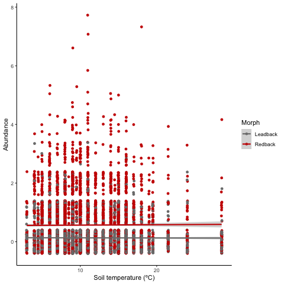

---
## I have commented out the default YAML title and removed the author and data 
## info as I don't really as I don't want them to appear on the title page

title: "BIOL548T manuscript"

# This sets up the format to match most journal requirements of 1" margins
# and 12pt Times new Roman font. The catch is that to specify the font
# you have to use the xelatex latex_engine. Also important to note, most 
# journals need Word files (or Latex) for copy editing. You can simply
# comment out lines (20, 21, 23 and 24) and uncomment the 
# word_document output. 
# 
geometry: margin=1in
header-includes:
    - \usepackage{setspace}
    - \doublespacing
    - \usepackage{lineno}
    - \linenumbers
    - \usepackage{fontspec}         # can only be used with xelatex output
    - \setmainfont{Times New Roman} # can only be used with xelatex output

output:
  pdf_document:
    latex_engine: xelatex

## Specify your csl here. You can use local or remote 
## sources of csl files but local is better.
## below are two good sources of CSL files
## https://github.com/citation-style-language/styles
## https://www.zotero.org/styles

# csl: https://raw.githubusercontent.com/citation-style-language/styles/master/ecology-letters.csl
csl: https://www.zotero.org/styles/ecology-letters
# csl: "ecology-letters.csl"

# The .bib file allows you to add citations without Zotero and to share your
# library with co-authors so that everyone has the same list of potential
# references. Co-authors can just add new entries to the .bib file if they think
# a citation is relevant
bibliography: references.bib
---

**Title**: BIOL548T manuscript

Sarah Ravoth^1^\*

1.  Dept. of Zoology, University of British Columbia

\*Corresponding Author

email: ravoth\@zoology.ubc.ca

**Author Contributions:** SR came up with concept, wrote scripts to analyse data, and wrote this manuscript.

**Data Availability:** The data and code that support the findings of this study are openly available from the Government of Canada at <https://open.canada.ca/data/en/dataset/3571474b-8d75-491d-816e-f84677b81a7c>.

**Conflict of Interest statement**

No conflicts of interest.

**Acknowledgements:** I want to thank salamanders!

\newpage

# Abstract

*Plethodon cinereus* salamanders exist in Bruce Peninsula National Park, Ontario, Canada. I downloaded data to analyse how colour morph affects the relationship between soil temperature (degrees Celsius) and abundance. I produced one figure.

**Key-words**: salamanders, abundance, temperature

\newpage

# Introduction

I used some references in this project (@noël2007, @wiggins2011).

# Methods

I did some funky things in R!

# Results

There is not qualitative relationship between *P. cinereus* abundance and soil temperature for both colour morph (Figure 1).

 Figure 1. Effect of soil temperature (degrees Celsuis) on redback salamander abundance in Bruce Peninsula National Park.

# Discussion

Some smart discussion here.

# References

```{=html}
<!-- this littel code block is a comment that won't show up in the knitted 
document. It is a good way to add hidden things and comments to your RMarkdown 
document. For example... -->
```
```{=html}
<!-- this little chunk of code (the ::: stuff below) forces the references to show up here. If you
don't use this then they are put at the end of the document by default -->
```
::: {#refs}
:::

```{=tex}
\vspace{-2pc}
\setlength{\parindent}{-0.5in}
\setlength{\leftskip}{-1in}
\setlength{\parskip}{8pt}
```
